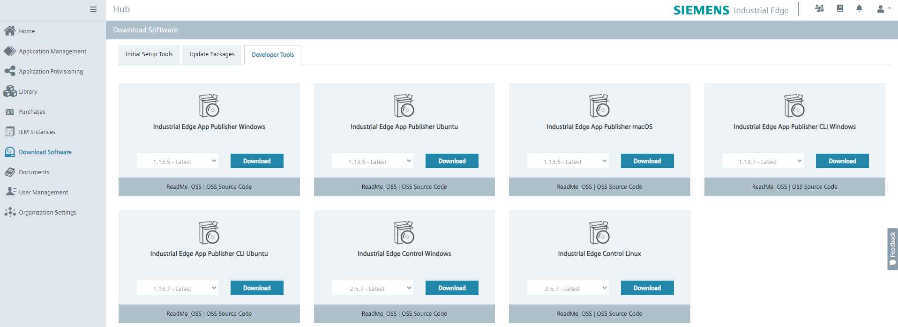
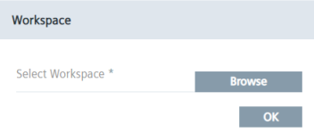
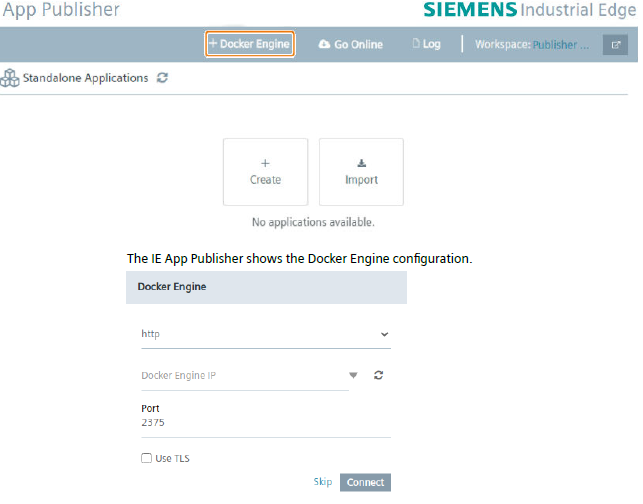
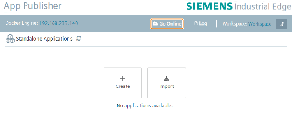

# STEPS TO BUILD A UBUNTU VIRTUAL MACHINE FOR INDUSTRIAL EDGE PUBLISHER

<!--  -->
- [STEPS TO BUILD A UBUNTU VIRTUAL MACHINE FOR INDUSTRIAL EDGE PUBLISHER](#steps-to-build-a-ubuntu-virtual-machine-for-industrial-edge-publisher)
  - [Introduction](#introduction)
  - [Prerequistes](#prerequistes)
  - [Install Docker](#install-docker)
    - [Uninstall old and conflicting packages](#uninstall-old-and-conflicting-packages)
    - [Install via apt repository](#install-via-apt-repository)
    - [Linux post-installation steps for Docker Engine](#linux-post-installation-steps-for-docker-engine)
    - [Configure Docker to start on boot with systemd](#configure-docker-to-start-on-boot-with-systemd)
  - [Expose Docker socket on TCP port](#expose-docker-socket-on-tcp-port)
  - [Download the Industrial Edge App Publisher](#download-the-industrial-edge-app-publisher)
    - [Download](#download)
    - [Installation](#installation)
  - [Set-up the Industrial Edge App Publisher](#set-up-the-industrial-edge-app-publisher)
    - [Connecting to a workspace](#connecting-to-a-workspace)
    - [Connecting to the Docker Engine](#connecting-to-the-docker-engine)
    - [Connecting to an IEM instance](#connecting-to-an-iem-instance)

## Introduction

This guide aims to guide you through the installation and setup of **Docker engine** on your development **Ubuntu** Virtual Machine, moreover it will show you how to setup the **Edge App Publisher** integration:
- The first part of this document aims to condense and present a more compact version of the guidelines presented in the [official Docker documentation](https://docs.docker.com/engine/install/ubuntu/).
- The second section will guide you through the required **Docker** setting that are needed to allow the communication between the **Edge App Publisher** and the **Docker Engine**.
- The third section focuses on the **download** and **installation** of the **Edge App Publisher**.
- The last section shows the **Edge App Publisher** configuration.

## Prerequistes

- A Ubuntu based Virtual Machine with at least 2 CPU cores and 4GB RAM.

## Install Docker

In this section we will go through the main steps required to install **Docker** on your **Ubuntu** instance.

### Uninstall old and conflicting packages

Before you can install Docker Engine, you need to uninstall any conflicting packages and unofficial Docker apt packages provided by distro maintainers:

- `docker.io`
- `docker-compose`
- `docker-compose-v2`
- `docker-doc`
- `podman-docker`

Moreover, if you have installed the `containerd` or `runc` previously, uninstall them to avoid conflicts with the versions bundled with Docker Engine:

```
for pkg in docker.io docker-doc docker-compose docker-compose-v2 podman-docker containerd runc; do sudo apt-get remove $pkg; done
```

Images, containers, volumes, and networks stored in `/var/lib/docker/` aren't automatically removed when you uninstall **Docker**. If you want to start with a clean installation do:

```
sudo apt-get purge docker-ce docker-ce-cli containerd.io docker-buildx-plugin docker-compose-plugin docker-ce-rootless-extras
```

Delete all images, containers, volumes and custom configuration files:

```
sudo rm -rf /var/lib/docker
sudo rm -rf /var/lib/containerd
```

### Install via apt repository

1. Set up Docker's **apt** repository:

    - Add Docker's official GPG key:

        ```
        sudo apt-get update
        sudo apt-get install ca-certificates curl
        sudo install -m 0755 -d /etc/apt/keyrings
        sudo curl -fsSL https://download.docker.com/linux/ubuntu/gpg -o /etc/apt/keyrings/docker.asc
        sudo chmod a+r /etc/apt/keyrings/docker.asc
        ```
    - Add the repository to Apt sources:
        ```
        echo \
        "deb [arch=$(dpkg --print-architecture) signed-by=/etc/apt/keyrings/docker.asc] https://download.docker.com/linux/ubuntu \
        $(. /etc/os-release && echo "$VERSION_CODENAME") stable" | \
        sudo tee /etc/apt/sources.list.d/docker.list > /dev/null
        sudo apt-get update
        ```

2. Install Docker:

    ```
    sudo apt-get install docker-ce docker-ce-cli containerd.io docker-buildx-plugin docker-compose-plugin
    ```

3. Verify that Docker Engine is installed correctly by running the `hello-world` image:

    ```
    sudo docker run hello-world
    ```

### Linux post-installation steps for Docker Engine

The Docker daemon binds to a Unix socket; by default it's the `root` user that owns the Unix socket, and other users can only access it using `sudo`. If you don’t want to preface the `docker` command with `sudo`, create a **Unix group** called `docker` and **add users to it**. When the Docker daemon starts, it creates a Unix socket accessible by members of the `docker` group.

> **Note:** The docker group grants root-level privileges to the user. For details on how this impacts security in your system, see [Docker Daemon Attack Surface](https://docs.docker.com/engine/security/#docker-daemon-attack-surface).

1. Create the `docker` group if not already created during the installtion:
    ```
    sudo groupadd docker
    ```
2. Add your user to the `docker` group:
    ```
    sudo usermod -aG docker $USER
    ```
3. Log out and log back in so that your group membership is re-evaluated (in case of Linux VMs, it might be required to restart it). You can also run the following command to activate the changes to groups:
    ```
    newgrp docker
    ```
4. Verify that you can run `docker` commands without `sudo`:
    ```
    docker run hello-world
    ```

### Configure Docker to start on boot with systemd

To enable Docker auto-start:
```
sudo systemctl enable docker.service
sudo systemctl enable containerd.service
```

To disable Docker auto-start:
```
sudo systemctl disable docker.service
sudo systemctl disable containerd.service
```

## Expose Docker socket on TCP port

The **Industrial Edge App Publisher** reuires to have access to the docker socket; to allow this, some configuration has to be applied on the machine where you are running Docker, in particular, you have to expose the Docker socket for external access.

- External **unsafe** access:
  - Edit the default Docker configuration:
    - Run:
      ```sudo systemctl edit docker.service```
    - Find the line:
     ```ExecStart=/usr/bin/dockerd ...```
    - Edit the line and keep only:
     ```ExecStart=/usr/bin/dockerd```
    - Save the file and close it by pressing `ctrl` + `o` → `Enter` → `ctrl` + `x`
  - Open the daemon configuration file and edit it:

    ```bash
    sudo nano /etc/docker/daemon.json
    ```

  - Add the following content (the port `2375` is the default one):

    ```json
    "hosts": ["unix:///var/run/docker.sock", "tcp://0.0.0.0:2375"]
    ```

  - After making changes to the Docker daemon configuration, restart the Docker service:

    ```bash
    sudo systemctl restart docker
    ```

  - Ensure that your firewall allows incoming traffic on the Docker API port (default is `2375`). Adjust your firewall rules accordingly:

    ```bash
    sudo ufw allow 2375
    ```

  - Verify the new firewall rules:

    ```bash
    sudo ufw status verbose
    ```

  > **Note 1:** Exposing the Docker API without proper authentication and encryption is a security risk. It's recommended to use TLS for securing the communication between the client and the Docker daemon.
  > **Note 2:** In order to allow access to the docker socket, it is possible to also edit the Docker service: `sudo systemctl edit docker.service` and add `ExecStart=/usr/bin/dockerd -H unix:///var/run/docker.sock -H tcp://0.0.0.0:2375` under `[Service]`.
  > **Note 3:** Another way to expose the socket is to edit the file `/lib/systemd/system/docker.service`, find the line `ExecStart=/usr/bin/docker daemon -H fd://` and add at the end `-H tcp://0.0.0.0:2375`.

- External **safe** access:
  - Generate TLS Certificates (**CA** and **Server**):

    ```bash
    # Choose a folder to store your certs
    mkdir -p /path/to/your/cert
    
    # Generate the CA certs
    openssl genrsa -aes256 -out ca-key.pem 4096
    openssl req -new -x509 -key ca-key.pem -sha256 -out ca.pem
    
    # Generate the server signing request
    openssl genrsa -out server-key.pem 4096
    openssl req -subj "/CN=$HOST" -sha256 -new -key server-key.pem -out server.csr
    
    # Add the IP addresses and host names of the server
    # that will be used for the connection
    echo subjectAltName = DNS:$HOST,IP:127.0.0.1,IP:192.168.153.128 >> extfile.cnf
    echo extendedKeyUsage = serverAuth >> extfile.cnf

    # Create the server certificate and sign it
    openssl x509 -req -sha256 -in server.csr -CA ca.pem -CAkey ca-key.pem \
      -CAcreateserial -out server-cert.pem -extfile extfile.cnf
    ```

  - Create the client certificate that will be used by the **Edge Publisher** app:

    ```bash
    # Create a client key and certificate signing request:
    openssl genrsa -out key.pem 4096
    openssl req -subj '/CN=client' -new -key key.pem -out client.csr

    # To make the key suitable for client authentication,
    # create a new extensions config file:
    echo extendedKeyUsage = clientAuth > extfile-client.cnf

    # Generate the signed certificate for the client:
    openssl x509 -req -sha256 -in client.csr -CA ca.pem -CAkey ca-key.pem \
      -CAcreateserial -out cert.pem -extfile extfile-client.cnf
    ```

  - Open the daemon configuration file and edit it:

    ```bash
    sudo nano /etc/docker/daemon.json
    ```

  - Configure Docker Daemon by adding the following *key-value* pairs (edit the configuration based on your deployment setup):

    ```json
    "hosts": ["unix:///var/run/docker.sock", "tcp://0.0.0.0:2375"],
    "tls": true,
    "tlsverify": true,
    "tlscacert": "/path/to/your/cert/ca.pem",
    "tlscert": "/path/to/your/cert/server-cert.pem",
    "tlskey": "/path/to/your/cert/server-key.pem"
    ```

  - After making changes to the Docker daemon configuration, restart the Docker service:

    ```bash
    sudo systemctl restart docker
    ```

  - Ensure that your firewall allows incoming traffic on the Docker API port (default is `2375`). Adjust your firewall rules accordingly:

    ```bash
    sudo ufw allow 2375
    ```

  - Verify the new firewall rules:

    ```bash
    sudo ufw status verbose
    ```

  > **Note 1:** These changes can be also applied without changing the `daemon.json` file. To do this, run `sudo systemctl edit docker.service` and modify the line `ExecStart=/usr/bin/dockerd -H unix:///var/run/docker.sock` by adding at the end `-H tcp://0.0.0.0:2375 --tlsverify --tlscacert=<location of ca certificate> --tlscert=<location of server certificate> --tlskey=<location of server key>`.
  > **Note 2:** To have a better understanding of TLS certificates [check this guide](https://github.com/SiemensIndustrialEdgeITA/edge-certificates-guide).

## Download the Industrial Edge App Publisher

### Download

The **Industrial Edge App Publisher** can be downloaded from the [Industrial Edge Hub](https://iehub.eu1.edge.siemens.cloud/). Once you log in with your credentials, you have to go under **Download Software**, then select the **Developer Tools** tab and then download the **Industrial Edge App Publisher** that suits your needs.

> **Note 1:** You can find the **Industrial Edge App Publisher** full documentation [here](https://support.industry.siemens.com/cs/document/109814441/industrial-edge-app-publisher-operation).
> **Note 2:** The easyest way to develop and publish Industrial Edge applications is via Ubuntu Desktop, that can be used both as development environment and to publish the applications. This allows you to avoid further configurations that might be required when using Docker or the IE App Publisher on Windows.



### Installation

Once you downloaded the **Industrial Edge App Publisher**, you can install it on Ubuntu via the following command (it will install the package and will also manage all its dependencies):

```bash
sudo apt-get install -f ./industrial-edge-app-publisher-vX.XX.X.deb
```

Where `X.XX.X` has to be the version of the publisher you downloaded.

## Set-up the Industrial Edge App Publisher

### Connecting to a workspace

To work with the **Industrial Edge App Publisher**, you need to create one folder as a workspace root folder; the workspace folder is where all the standalone application's meta-data are kept. If you are connected to IEM then the meta-data of application's versions which are not yet uploaded are kept in the selected workspace.

1. Run the IE App Publisher.
2. Click on the "Browse" button and select a folder as your workspace.
   
    
  
    You can select an empty folder or an existing IE App Publisher workspace.
    The IE App Publisher stores your Apps in your workspace.

3. Click on the "OK" button to create the workspace.

### Connecting to the Docker Engine

This section describes how to connect to a Docker Engine to be able to integrate images directly from there. You can find [here](https://docs.docker.com/engine/install/) an example how to install a Docker Engine in the Internet.

1. Click on the "+Docker Engine" button.
    
    

2. Choose the application protocol that the Docker Engine uses from the drop-down menu.
3. Enter the IP and the port of the Docker Engine in the respective input fields. By default, port `2375` is set but can be changed. To check for a connection with the Docker Engine, press the refresh button. There is no message after the check.
4. For a secure communication, activate the TLS (Transport Layer Security) option flag and import the required files that were created [here](#expose-docker-socket-on-tcp-port) and select `https` instead of `http`:
   - Select Ca file: `ca.pem`
   - Select Cert file: `cert.pem`
   - Select Key file: `key.pem`
5. Click on the "Connect" button.
   The connection to the Docker Engine is established.

### Connecting to an IEM instance

This section describes how establish a connection to an IEM, so that you will be able to directly manage the Edge Apps that you deploy to your IEM.
You can find more detailed information about the IEM in the ["Industrial Edge Management–Operation" manual](https://support.industry.siemens.com/cs/us/en/view/109780393).

1. Click on the "Go Online" button.
   The IE App Publisher shows the Edge Management Configuration.

   

2. Type the URL or IP of an IEM into the "Edge Management URL" input field.
3. Click on the "Connect" button.
   The IE App Publisher is connected to the Edge Management with the URL or IP in the input
field.