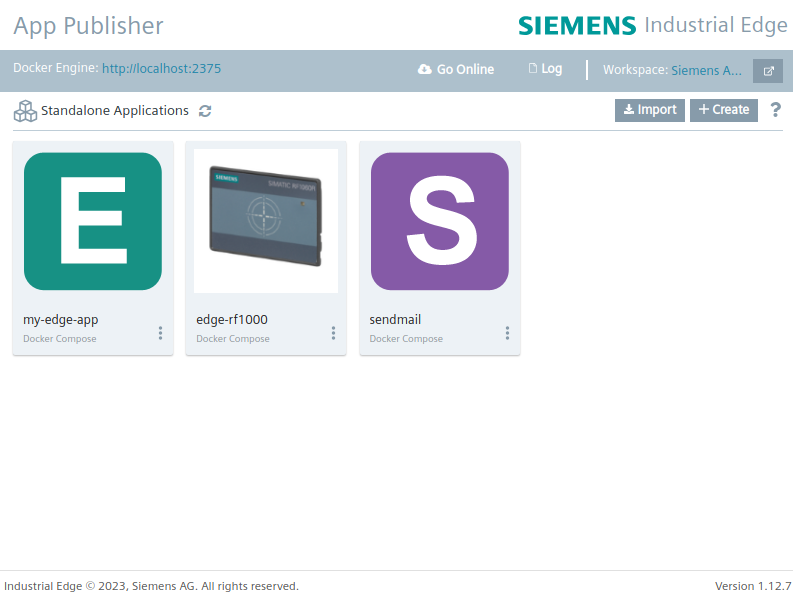

# HOW TO DEVELOP AN APPLICATION FOR INDUSTRIAL EDGE

- [HOW TO DEVELOP AN APPLICATION FOR INDUSTRIAL EDGE](#how-to-develop-an-application-for-industrial-edge)
  - [Introduction](#introduction)
    - [Covered topics](#covered-topics)
    - [Pre-requirements](#pre-requirements)
  - [Application overview](#application-overview)
  - [Configure your application via the Dockerfile](#configure-your-application-via-the-dockerfile)
    - [What is a Dockerfile](#what-is-a-dockerfile)
  - [Prepare a sample application](#prepare-a-sample-application)
    - [Back-end](#back-end)
      - [Functioning](#functioning)
      - [What you will learn](#what-you-will-learn)
      - [Dockerfile](#dockerfile)
        - [Base image definition](#base-image-definition)
        - [Load files to the new image](#load-files-to-the-new-image)
        - [Run commands inside the image](#run-commands-inside-the-image)
        - [Set a work directory](#set-a-work-directory)
        - [Run the application inside the container](#run-the-application-inside-the-container)
    - [Front-end](#front-end)
      - [Functioning](#functioning-1)
      - [What you will learn](#what-you-will-learn-1)
      - [Dockerfile](#dockerfile-1)
        - [Multi-stage Docker image](#multi-stage-docker-image)
    - [Database](#database)
      - [Functioning](#functioning-2)
      - [What you will learn](#what-you-will-learn-2)
      - [Database initialization](#database-initialization)
  - [Build your Docker images](#build-your-docker-images)
  - [Deployment blueprint: docker-compose.yaml](#deployment-blueprint-docker-composeyaml)
    - [What is a docker-compose.yaml file](#what-is-a-docker-composeyaml-file)
    - [Our sample docker-compose.yaml file](#our-sample-docker-composeyaml-file)
      - [Configuration](#configuration)
  - [Packaging the application for Industrial Edge](#packaging-the-application-for-industrial-edge)
    - [Create the application](#create-the-application)
    - [Load the application from Docker to the App Publisher](#load-the-application-from-docker-to-the-app-publisher)
    - [Export the application as .app file](#export-the-application-as-app-file)
  - [Import the .app file inside the Industrial Edge Management](#import-the-app-file-inside-the-industrial-edge-management)
  - [Import the application to an Industrial Edge Device](#import-the-application-to-an-industrial-edge-device)
  - [Access and monitor the deployed IE application](#access-and-monitor-the-deployed-ie-application)
  - [FAQ](#faq)
    - [What is the best setup to develop an Edge application?](#what-is-the-best-setup-to-develop-an-edge-application)
    - [What are the best practices for developing Industrial Edge Applications?](#what-are-the-best-practices-for-developing-industrial-edge-applications)
    - [Are there any additional tools or cheat sheets?](#are-there-any-additional-tools-or-cheat-sheets)
  - [Useful readings](#useful-readings)

## Introduction

The Siemens Industrial Edge platform exploits the advantages of the Docker platform to manage the deployment of applications inside of the Edge Devices.
This guide has the focus to give you a deeper insight on how to develop or migrate a standard application to the Industrial Edge ecosystem.
Keep in mind that there are many more configurations, compared to the ones described here, that can be done via the Dockerfile, docker-compose and Industrial Edge environment; to dive deeper into these topics, please visit the official [Docker](https://www.docker.com/) and [Industrial Edge](https://www.siemens.com/global/en/products/automation/topic-areas/industrial-edge/production-machines.html) websites.

### Covered topics

- Configure your application via the `Dockerfile`:
  - Choose the **Docker image** that suits your needs.
  - **Useful commands** to build your image: **Python** application example.
  - Reduce your Docker image size using a **Multi-Stage** build: **React/Nodejs** application example.
  - Build your Docker image.
- Configure your deployment system: `docker-compose.yaml` file.
- Pack your application for Industrial Edge via the **Edge Publisher** application.
- Import your custom application to your **Industrial Edge Management**.
- Deploy your application to your **Industrial Edge Devices**.
- Access and monitor your installed Edge Application.

### Pre-requirements

The main requirement to develop and deploy application for **Siemens Industrial Edge** is a correctly set-up development environment, with installed the **Docker Engine** and the **Edge App Publisher**. More information can be found [here](./development_environment_setup.md).

## Application overview


The application that is used in this example consists of three different parts:

- **Front-end:**
  - **Upper textbox:** allows to insert a string.
  - **Upper button** *Send data to DB*: when clicked, it sends an `HTTP POST` call to the backend software with the textbox data information as `json`:
   ```{"text": <TEXTBOX_VALUE>}```
  - **Lower textbox**: shows the latest reversed text data that was stored in the database.
  - **Lower button** Get latest data: when clicked, it sends an `HTTP GET` call to the backend software asking for the newest row that was inserted in the database. When the frontend gets the requested data, they are presented in `json` format:

      ```json
      {
         "res": [
            [
               "Mon, 27 Nov 2023 13:21:52 GMT",
               "This text will be reversed",
               "desrever eb lliw txet sihT"
            ]
         ]
      }
      ```

- **Back-end:** the Python back-end software exposes two APIs that allow to save to the database a text string, the same string reversed and the insertion timestamp (`HTTP POST` call); moreover, it allows to get the latest inserted data (`HTTP GET` call).
- **Database:** it is used to store the text strings, the reversed string and the insert timestamp.

## Configure your application via the Dockerfile

### What is a Dockerfile

A Dockerfile is a text-based script used to define a set of instructions for building a Docker image. Docker is a platform that simplifies the process of creating, deploying, and managing applications using containers. A Docker image is a lightweight, standalone, executable package that includes everything needed to run a piece of software, including the code, runtime, system tools, system libraries, and settings.

A Dockerfile is essentially a recipe that specifies the steps needed to create a Docker image. It contains commands that describe how the image should be configured, what software should be installed, and how the application should be set up within the container.

## Prepare a sample application

This section will go through the different components of the application and aims to show you the main configurations that can be used to build a `Docker image`.

### Back-end

#### Functioning

The **back-end** uses a simple Python program that will be Dockerized and released as one of the components of a bigger IE application.
This application is a simple web server, based on Flask, that manages two web APIs:

- **HTTP POST**:
  - Path: `/api/post-data`
  - Body: json data in the form `{"text": <TEXT_VALUE>}`
  - Response: json data in the form `{"text": <REVERSED_TEXT_VALUE>}` with code `200`
- **HTTP GET**:
  - Path: `/api/get-last-data`
  - Response: json data in the form `{"res": [["Mon, 27 Nov 2023 13:21:52 GMT", "This text will be reversed", "desrever eb lliw txet sihT"]]}` with code `200`

#### What you will learn

- **Base image definition**: build your application upon one of the standard Docker images.
- **Load files to the new image**: load your program and files to the Docker image.
- **Run commands inside the image**: run shell commands as you would on a standard OS.
- **Set a work directory**: run shell commands in a more compact way.
- **Host - Container paths binding**: map folders and files between the container and the host machine.
- **Run the application inside the container**: select the programs or the scripts that will be run inside the docker container once it is deployed.

#### Dockerfile

The **back-end** `Dockerfile` specifies multiple informations that are used to build the Docker image:

##### Base image definition

  In Docker, the `FROM` field is a directive used in Dockerfiles to specify the base image that a new image is built upon. It's typically the first instruction in a `Dockerfile` and sets the base image for subsequent instructions. When building a new Docker image, the `FROM` instruction pulls an existing image from a repository (like [Docker Hub](https://hub.docker.com/)) and uses it as the starting point to layer and build your custom image.

  ```docker
  FROM python:3.11-slim-bullseye
  ```
  
  For instance, `FROM python:3.11-slim-bullseye` specifies that the new image being created will use the version `3.11-slim-bullseye` of the [Python base image](https://hub.docker.com/_/python).
  
  This base image contains the operating system, tools, libraries, and configurations necessary for your application or service. Building on top of established base images helps ensure consistency and repeatability in your Docker deployments.

##### Load files to the new image

  The `COPY` instruction in the `Dockerfile` is used to copy files or directories from the host machine into the Docker image being built. It takes two arguments: a *source* and a *destination*.
  The command is in the form: `COPY <source> <destination>`.

  ```docker
  # Copy python requirements
  COPY ./requirements.txt /

  # Copy app
  COPY ./src/main.py ./
  COPY ./src/sql_manager.py ./
  ```

##### Run commands inside the image

  The `RUN` command in a `Dockerfile` is used to execute commands during the image-building process. It allows to run any command that would normally be run in a terminal.
  
  ```docker
  # Install dependencies and install python packages
  RUN apt-get update &&\
     apt-get install -y --no-install-recommends tzdata libudev-dev -y &&\
     python3 -m pip install --upgrade --no-cache-dir pip &&\
     python3 -m pip install --upgrade --no-cache-dir -r requirements.txt &&\
     rm -rf /var/lib/apt/lists/* && mkdir /App
  ```

  The `RUN` command is used for installing dependencies, setting up the environment, and performing any necessary setup steps within the Docker image during the build process.

##### Set a work directory

  The `WORKDIR` command in a `Dockerfile` is used to set the working directory for any subsequent `RUN`, `CMD`, `ENTRYPOINT`, `COPY`, and `ADD` instructions in the `Dockerfile`.

  ```docker
  # Set new work directory
  WORKDIR /App
  ```
  
  Setting the working directory using `WORKDIR` helps simplify and streamline subsequent commands by avoiding to specify full paths repeatedly. It also enhances readability and maintainability of the Dockerfile.

  Additionally, using `WORKDIR` is beneficial as it provides a way to ensure consistency across different environments where the Docker image might be used, as it sets a predictable working directory for operations within the container.

##### Run the application inside the container

  The `ENTRYPOINT` instruction in a `Dockerfile` is used to specify the command that will run when a Docker container is started from the image. It provides the default executable for the container.

  The basic syntax of the `ENTRYPOINT` instruction is:

  ```docker
  # Format
  ENTRYPOINT ["executable", "param1", "param2"]

  # Example: Start application
  ENTRYPOINT ["python", "main.py"]
  ```
  
  When the `ENTRYPOINT` is specified in a `Dockerfile`, it can be overridden by providing a command and arguments when running the container. For instance, if the `ENTRYPOINT` is set to run a Python script but you want to execute a different script when starting the container, you can do so by providing the alternative command and arguments at runtime:

  ```bash
  docker run my-image python another_script.py
  ```

  This will run `another_script.py` instead of `main.py` defined in the `ENTRYPOINT`.

  The `ENTRYPOINT` is often used in conjunction with the `CMD` instruction in a Dockerfile. If both are specified, the `CMD` arguments are passed as arguments to the `ENTRYPOINT` command. This combination allows flexibility in defining a default executable while still allowing users to specify additional arguments when running containers.

  ```docker
  FROM python:3

  WORKDIR /app
  COPY . /app

  # Set the default executable for the container
  ENTRYPOINT ["python", "my_app.py"]

  # Default argument to be passed to the ENTRYPOINT
  CMD ["default_file.txt"]
  ```

  In this example:

- `ENTRYPOINT ["python", "my_app.py"]` sets `python my_app.py` as the default command to run when the container starts.
- `CMD ["default_file.txt"]` specifies `default_file.txt` as the default argument to be passed to `my_app.py` when no command-line arguments are provided.
  
  In case the container is run without providing any additional arguments, it will execute `python my_app.py default_file.txt`, as defined by the `ENTRYPOINT` and `CMD` combination in the `Dockerfile`.

  ```bash
  docker run my-image
  ```

  If you want to override the default argument and provide your own filename when running the container, you can do so by specifying the filename as an argument:

  ```bash
  docker run my-image custom_file.txt
  ```

  This command will execute `python my_app.py custom_file.txt`, where `custom_file.txt` is passed as an argument, overriding the default specified in the `CMD` instruction.

  Using `ENTRYPOINT` with `CMD` provides a way to set a default command and optionally provide arguments, allowing users to customize the behavior of the container at runtime.

### Front-end

#### Functioning

The **front-end** is a simple React program that will be Dockerized and released as one of the components of a bigger **IE application**.
This container uses [nginx](https://www.nginx.com/) to serve a simple web page with the following components:

- **Upper area**:
  
  

  - **Textbox**: allows to insert a string.
  - **Button "Send data to DB"**: when clicked, it sends an `HTTP POST` call to the backend software with the textbox data information as `json`: ```{"text": <TEXTBOX_VALUE>}```.

- **Lower area**:
  
  
  
  - **Textbox**: shows the latest reversed text data that was stored inside the database.
  - **Button "Get latest data"**: when clicked, it sends an `HTTP GET` call to the backend software asking for the newest row that was inserted inside the database. When the frontend gets the requested data, they are presented as `json`:

    ```json
    {
       "res": [
          [
             "Mon, 27 Nov 2023 13:21:52 GMT",
             "This text will be reversed",
             "desrever eb lliw txet sihT"
          ]
       ]
    }
    ```

#### What you will learn

- **Multi-stage Docker image**: create a temporary build environment in Docker to build your dependencies and compile your code, then move your build to a new lightweight Docker image.

#### Dockerfile

##### Multi-stage Docker image

A multi-stage Docker image is a technique used to optimize the size of Docker images and improve the efficiency of the build process. It involves using multiple `FROM` statements in a Dockerfile to create different stages in the build process. Each stage represents a different phase of building the final image.

The primary goal of using multi-stage builds is to separate different aspects of the build process, such as compiling code, installing dependencies, and packaging the application, into distinct stages within the same Dockerfile. This helps in reducing the size of the final Docker image by discarding unnecessary build dependencies and artifacts that are only needed during the build process but not in the final runtime environment.

For example, in a typical scenario where you are building a software application, the first stage might involve using an image with the necessary build tools to compile the code, while the subsequent stages could involve copying the compiled artifacts into a smaller base image designed specifically for runtime.

Here's a basic example of a multi-stage Dockerfile:

```docker
###########
# STAGE 1 #
###########

# Select base image for the build environment
FROM node:18-alpine as builder

# set working directory
WORKDIR /app

# install app dependencies
COPY ./ .
RUN npm install

# build
RUN npm run build

###########
# STAGE 2 #
###########

# Select the base image for the final build
FROM nginx:1.25.3

# set working directory
WORKDIR /usr/share/nginx/html

RUN rm -rf ./*

# add app
COPY --from=builder /app/build/ .

# start app
CMD ["nginx", "-g", "daemon off;"]
```

In this example, the first stage (**builder**) uses the `node:18-alpine` base image to compile the code and build the React code. Then, in the second stage, it switches to the `nginx:1.25.3` image and copies only the compiled code from the previous stage, creating a final lightweight image that contains only the necessary runtime components (i.e. the *node modules* installed via `RUN npm install`, that are used to build the application, are not transfered to the final image).

Using multi-stage builds can significantly reduce the size of the Docker image and improve overall performance by separating build dependencies from the final runtime environment.

### Database

#### Functioning

In order to persist the data inserted via the web page, a **Postgres** database instance is deployed.
The database structure is initialized via the `init.sql` file that contains all the SQL commands required to create the table and the user that are used in this example.

#### What you will learn

- **Database initialization**: it is a common practice to create and deploy a custom image of already "set-up" databases, this allows to have a "ready to go" image that can be transfered on multiple deployments, without requiring to log-in to the database and set it up it every time.

#### Database initialization

Remember that each database has its own way to be configured, always refer to the official database documentation to learn how it can be initialized.

- **Postgres**: in order to build the Postgres image with the specifications wrtitten inside the `init.sql` file, you just have to copy this file to the `/docker-entrypoint-initdb.d/` path inside the Docker image:

  ```docker
  COPY init.sql /docker-entrypoint-initdb.d/
  ```

## Build your Docker images

To deploy your application, you have to build your docker images:

```docker
docker build -t <IMAGE NAME>:<IMAGE TAG> .
```

> **Note:** you can find futrher informations about the available `docker build` flags [here](https://docs.docker.com/engine/reference/commandline/build/).

In our example there are three images:

```docker
# Back-end image
docker build -t my-python-demo .

# Front-end image
docker build -t my-react-demo .

# Database image
docker build -t my-postgres-demo .
```

> **Note 1:** we omitted the \<IMAGE TAG\> so that docker will label the image with the default tag `latest`.
> **Note 2:** it is always a good practice to use image tags to manage the application versioning.

## Deployment blueprint: docker-compose.yaml

Now that all the images are ready, it is fundamental to define their deployment configuration via the `docker-compose.yaml` file.

### What is a docker-compose.yaml file

A `docker-compose.yaml` file is a configuration file used by Docker to define and run multi-container applications. It is a YAML file that describes the services, networks, and volumes required for your application's setup.
This file can be useful in case you need to test your application in a local environment and it is also required by the **Edge Publisher** to build an **Industrial Edge application package**.

Here are some key components typically found in a `docker-compose.yaml` file:

- **Services**: Each service represents a container and defines its image (the ones that we previously created with the `Dockerfile`), build configuration, ports, environment variables, volumes, and other settings needed to run the container.

- **Networks**: It defines the networks that the service uses to communicate with other services and applications; allows containers within the same Docker compose file to communicate to each other. You can define custom networks to isolate or group services together.

- **Volumes**: Volumes enable data persistence by creating a shared filesystem that containers can use to store and access data. This helps in persisting data when containers are destroyed.

> **Note:** multiple other parameters and configurations can be defined via the `docker-compose.yaml` file. In case you want a deeper understanding of its configurations, you should take a look to the [official documentation](https://docs.docker.com/compose/compose-file/).

### Our sample docker-compose.yaml file

In this example, the `docker-compose.yaml` file was configured to show you some of the main settings parameters; moreover, this guide will focus on some limitations and requirements that are specific to the **Industrial Edge ecosystem**.

#### Configuration

This section describes all the settings that were used to configure [this sample](../code/docker-compose.yaml) `docker-compose.yaml` file:

- **version:** it specifies the version of the **Docker Compose** file format being used. It essentially defines the schema and features available for that particular `docker-compose.yaml` file. Different versions may support different features or syntax.Please, check the available versions in your **Industrial Edge App Publisher**.
- **services:** it is used to define the different services that compose your application. Each service is configured with various parameters to specify how the containers should be built, run, and connected to other services.
  This sample application defines three services: `my-react-demo` (frontend), `my-python-demo` (backend), `my-postgres-demo` (database).
  Here below you can find further information regarding the parameters that are used:
  
  - **image:** it is the name of the image that will be used to run the defined service (the name defined via the `-t` flag [when building the image](#build-your-docker-images)).
  
  - **restart:**  it is used to specify the restart policy for containers within a service. It defines what action Docker should take if a container exits or encounters an error.
  The restart flag can take different values:

    - **no**: This is the default. It means that Docker won't attempt to restart the container if it stops for any reason.

    - **always**: Docker will restart the container automatically if it stops, regardless of the exit code or the reason for stopping.

    - **on-failure**: The container will be restarted only if it exits with a non-zero exit status (indicating a failure). You can also specify a maximum number of restart attempts using restart `on-failure:5` (where you can freely define the threshold), limiting the number of restarts within the specified threshold.

    - **unless-stopped**: Docker will restart the container unless it is explicitly stopped by the user. It's similar to "always" but gives the user control to stop the container without Docker automatically restarting it.
  
  - **environment:** it is used to set environment variables within a service/container. Environment variables are key-value pairs that provide configuration or runtime information to applications running inside Docker containers.

    ```yaml
    # Environment variable definition
    environment:
      - ENV_VARIABLE1=value1
      - ENV_VARIABLE2=value2
    ```

    > **Note:** Environment variables can be used to define configurations that can be read by the deployed application.

  - **volumes:** it is used to define and manage data volumes for services. Volumes allow you to persist data generated or used by containers, ensuring that data isn't lost when containers are stopped or removed.
    There are different ways to define volumes in a `docker-compose.yaml` file:

    - **Named volumes:**
      When you define a named volume in Docker, you give it a specific name, and Docker takes care of creating and managing that volume. This named volume can be referenced and used by multiple containers, making it a useful way to share and persist data among different services or containers.
      It is defined as `<VOLUME_NAME>:/path/inside/the/container`.

      ```yaml
      volumes:
        - postgres-data:/var/lib/postgresql/data
      ```

      A **named volume** has to be defined under the `volume` section:

      ```yaml
      volumes:
        postgres-data:
      ```

    - **Anonymous volumes:** When you specify a volume without a named reference (like - `/app/data`), Docker creates an anonymous volume. These volumes are harder to manage since they don't have explicit names and can accumulate if not properly managed.

      ```yaml
      volumes:
        - /var/lib/postgresql/data
      ```

    - **Bind mounts:** It links a directory or file on the host machine (`/host/path`) to a directory inside the container (`/container/path`). Changes made on either side are reflected in real-time.
      An example of this usage, can be found in the `backend` service, here it binds the host path `./cfg-data/` to the container folder `/cfg-data/`.

      ```yaml
      volumes:
        - ./cfg-data/:/cfg-data/
      ```

      > **Note 1:** for security reasons, the Industrial Edge ecosystem only allows to map paths that starts with `./`.
      > **Note 2:** in case you need to access a phisical device, like a usb card reader, you have to use the `--device` flag.
  
  - **mem_limit:** it is used to limit the amount of memory that a container can use. It specifies the maximum amount of memory that the container can allocate from the host machine's memory.
    > **Note:** When building an **Industrial Edge** this parameter is mandatory.
  
  - **network:** it is used to define networks that containers, within a Docker Compose application, can connect to. Defining networks, using the networks flag, allows containers to communicate with each other securely within the defined network while segregating them from containers in other networks.

    > **Note:** the default network that has to be configured for the **Industrial Edge** ecosystem is `proxy-redirect`. This allows all the applications, custom and default, to be on the same network.
  
  - **ports:** it is used to map ports from a container to the host system, allowing external access to services running inside the container. It enables you to expose and publish container ports to specific ports on the host machine or to random ports on the host. The format to that allows this *host - container* mapping is `<host_port>:<container_port>`.

- **networks:** it is used to define custom networks that containers within a Docker Compose application can connect to.

## Packaging the application for Industrial Edge

This section describes how to create the application inside the **Edge App Publisher**.

> **Note:** There are multiple ways to import and configure the application inside the App Publisher, this guide describes one of these methods. For all other configurations and installation methods, please refer to the [official documentation](https://docs.eu1.edge.siemens.cloud/develop_an_application/ieap/preface.html).

### Create the application

To create a new **Industrial Edge Application**, click the "**+ Create**" button on the top right corner and then insert your application details.


After filling all the required fields, click the "**Create**" button. Your application is now available inside the **App Publisher**.



### Load the application from Docker to the App Publisher

Now it is time to import all the containers and configurations that are required to build the application.

1. Click the icon of the application you want to import, in this example "my-edge-app"; the page to import the application will be opend.
2. Click the "**+ Add New Version**" button and select the docker-compose version.
   
    

3. Click the "**Import YAML**" button and import the `docker-compose.yaml` file of your application.
   
    

4. Your `docker-compose.yaml` file is now loaded and you can check if the **App Publisher** discovered any error. If everything is fine, you can click the "**✓ Review**" button and then the "**Create**" button.
   
    

5. Insert your application version settings. Here you can also configure how the application can be accessed via the IED applications list, by selecting the desired url from the ones specified under `https://<IP-Address or DNS-Name>:18080:80 (frontend)`.
  
    

6. The application version is now displayed in the App Publisher menu.
  
    

7. Add a configuration file to the application (OPTIONAL): in case your application requires a configuration file, it can be loaded by clicking the "**+ Configurations**" button in the top right corner.
   
    
   
   The congiguration is now available inside the **App Publisher**.
   
    

### Export the application as .app file

By clicking the "**Export Version**" button, an `.app` file will be packaged and downloaded to your PC, so that it can be easily distributed across multiple **Industrial Edge Managements**; by selecting the output path and clicking the "**Export**" button, the **Edge Publisher** will pack all files, container images and configurations requred for the deployment.


## Import the .app file inside the Industrial Edge Management

This section shows how to load an `.app` file to the **IE Management**.

1. Log in to the target **IE Management**.
2. Click the "**+ Import Application**" in the top right corner.
 
    

3. Load the app file in the uploading window.
4. The application you loaded is now available inside your IE Management catalog.

## Import the application to an Industrial Edge Device

This section shows how to deploy your application to one or multiple **Industrial Edge Devices**:

1. Select the desired application.
 
   

2. Click the install button.
  
   

3. Modify and select the configuration if required.
 
   

4. Select the desired Industrial Edge Devices and click the install button that suits your needs.
 
   

## Access and monitor the deployed IE application

You can access and monitor your application directly from the **Industrial Edge Devices** where it was deployed.
In case the application has a web interface, that was configured via the **IE Publisher**, it can be accessed by clicking its icon in the **Apps** menu.
 
 

To monitor and manage the application you can use the **Management** menu.
 
 

## FAQ

### What is the best setup to develop an Edge application?

Considering the variety of applications that can be deployed on the **Industrial Edge** ecosystem, there is not an optimal deployment that can suit every use case. However, a good development solution can be the following:

- [Ubuntu Desktop](https://ubuntu.com/download/desktop) Virtual Machine with [installed the Docker Engine](https://docs.docker.com/desktop/install/linux-install/).
- [Industrial Edge Publisher](https://docs.eu1.edge.siemens.cloud/develop_an_application/ieap/download_the_ie_ap.html) installed on your Ubuntu Desktop Virtual Machine or Windows host.
- When possible, use a `docker-compose.yaml` file that has the same configuration that will be used for the final deployment. For example, the `docker-compose.yaml` that is used in this tutorial uses the `./cfg-data` folder; that can be easily accessed by the containers by running the `docker compose up` command locally and it can be also used by the application once it is deployed to **Industrial Edge**.

### What are the best practices for developing Industrial Edge Applications?

[Here you can find some hints about Industrial Edge App Development](https://docs.eu1.edge.siemens.cloud/develop_an_application/developer_guide/industrial_edge_platform/02_04_App%20Development%20Hint.html).

### Are there any additional tools or cheat sheets?

[Here you can find more informations about various tools and cheat sheets](https://docs.eu1.edge.siemens.cloud/develop_an_application/developer_guide/07_Additional%20Information.html).

## Useful readings

- [Linux capabilities](https://docs.eu1.edge.siemens.cloud/develop_an_application/developer_guide/industrial_edge_platform/docker_and_security/02_01_03_Linux%20Capabilities.html)
- [Use non-root user](https://docs.eu1.edge.siemens.cloud/develop_an_application/developer_guide/industrial_edge_platform/docker_and_security/02_01_04_Non%20Root%20User.html)
- [Security Extension Application Hardening](https://docs.eu1.edge.siemens.cloud/develop_an_application/developer_guide/handson_exercise/05_08_Application%20Hardening.html)
- [Network in Industrial Edge Environment](https://docs.eu1.edge.siemens.cloud/develop_an_application/developer_guide/industrial_edge_platform/network/02_02_Network%20in%20IE.html)
- [Layer 2 Network access](https://docs.eu1.edge.siemens.cloud/develop_an_application/app_architecture/l2_nw_access.html)
- [Create App Version with CPU Isolation](https://docs.eu1.edge.siemens.cloud/apis_and_references/iectl/howtos/devicefeature/cpuisolation.html)
- [Create App Version with GPU access](https://docs.eu1.edge.siemens.cloud/apis_and_references/iectl/howtos/devicefeature/gpu.html)