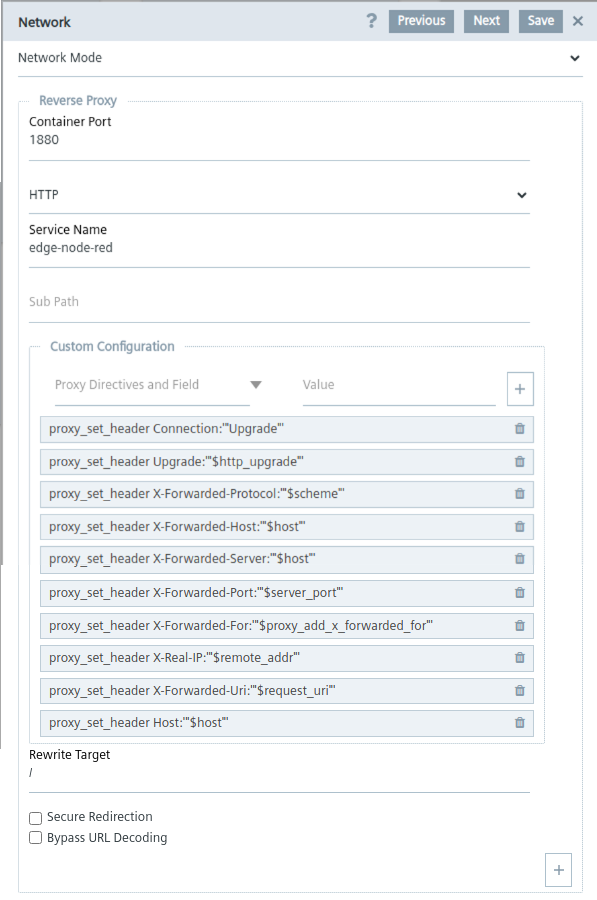

# REVERSE PROXY FOR INDUSTRIAL EDGE APPS

- [REVERSE PROXY FOR INDUSTRIAL EDGE APPS](#reverse-proxy-for-industrial-edge-apps)
  - [Introduction](#introduction)
    - [Reverse proxy](#reverse-proxy)
  - [Application setup](#application-setup)
    - [Iectl tool](#iectl-tool)
    - [Edit the configuration file](#edit-the-configuration-file)
      - [Edit the app version configuration file](#edit-the-app-version-configuration-file)
      - [Add Nginx configuration](#add-nginx-configuration)
  - [Appendix](#appendix)
    - [Nginx Reverse Proxy Headers](#nginx-reverse-proxy-headers)


## Introduction

When you deploy an app to an Edge Device, this app is visible as tile in the Edge Device UI. By clicking this tile, you will be redirected to the app's endpoint. An app developer can choose between the following 3 different options to define the redirect behavior: [Host Port](https://docs.eu1.edge.siemens.cloud/develop_an_application/ieap/app_redirection/redirect_to_host_port.html), [Reverse Proxy](https://docs.eu1.edge.siemens.cloud/develop_an_application/ieap/app_redirection/redirect_to_reverse_proxy.html), [Custom URL](https://docs.eu1.edge.siemens.cloud/develop_an_application/ieap/app_redirection/redirect_to_custom_url.html).

### Reverse proxy

The Industrial **Edge OS** runs a **reverse proxy** that can be used to securely access all applications from outside of the device; moreover, it gives you the possibility to access all applications that make use of the reverse proxy from the [Remote Connection functionality](https://docs.eu1.edge.siemens.cloud/get_started_and_operate/industrial_edge_management/vm/operation/edge_devices/enabling_and_disabling_remote_access.html) bundled within the **IEM**.

## Application setup

### Iectl tool

One method to achieve the reserse proxy integration is via the `iectl` tool for Industrial Edge. [Here you can find more information](https://docs.eu1.edge.siemens.cloud/apis_and_references/iectl/howtos/revproxy.html).

### Edit the configuration file

A more DIY approach, to setup the reverse proxy for your application, requires an existing application version that was configured using the **port binding** method [as described here](./how_to_develop_industrial_edge_apps.md#load-the-application-from-docker-to-the-app-publisher). This solution also allows to change the configuration of an existing application, without requiring to create a new version.

#### Edit the app version configuration file

In order to check this configuration, go to the `Siemens App Publisher` folder where all your projects are stored, open the desired one (note that each project will be identified by its application ID) and select the app version you just created, for example `Siemens App Publisher/HWmwPva6Pcaeny9rqTAK7VPF42kmBl1R/3.1.9-18`.
Inside the version folder there is a file called `detail.json` that contains the configurations we want to change, here is an example of standard configured application:

```
{
    "versionNumber": "3.1.9-18",
    "versionId": "FG2NmOajmRgtDJdBAkaFAYG8iqD2FibH",
    "title": "edge-node-red",
    "appId": "HWmwPva6Pcaeny9rqTAK7VPF42kmBl1R",
    "restRedirectUrl": "",
    "redirectSection": "edge-node-red",
    "redirectUrl": "1880",
    "redirectType": "FromBoxSpecificPort",
    "isAppSecure": false,
    "description": "Node-RED for Edge with some Extra Node package installed.",
    "swarmModeEnable": false,
    "required": [],
    "releaseNotes": "",
    "signUpType": "None",
    "externalConfigurator": false,
    "externalUrl": "",
    "webAddress": "www.siemens.com",
    "arch": "x86-64"
}
```

The only changes we have to implement here, regard the `redirectUrl` and the `redirectType`:

- **redirectUrl**: `<PORT_NUMBER>` **=>** `<EXPOSED_PATH>`
- **redirectType**: `FromBoxSpecificPort` **=>** `FromBoxReverseProxy`

Here an example of the updated configuration:

```
{
    "versionNumber": "3.1.9-18",
    "versionId": "FG2NmOajmRgtDJdBAkaFAYG8iqD2FibH",
    "title": "edge-node-red",
    "appId": "HWmwPva6Pcaeny9rqTAK7VPF42kmBl1R",
    "restRedirectUrl": "",
    "redirectSection": "edge-node-red",
    "redirectUrl": "edge-node-red/",
    "redirectType": "FromBoxReverseProxy",
    "isAppSecure": false,
    "description": "Node-RED for Edge with some Extra Node package installed.",
    "swarmModeEnable": false,
    "required": [],
    "releaseNotes": "",
    "signUpType": "None",
    "externalConfigurator": false,
    "externalUrl": "",
    "webAddress": "www.siemens.com",
    "arch": "x86-64"
}
```

#### Add Nginx configuration

Then go to the **repository** folder (the repository name that you used while creating the edge application), in this example `Siemens App Publisher/HWmwPva6Pcaeny9rqTAK7VPF42kmBl1R/3.1.9-18/edgenodered` and create a folder called `nginx`. Here inside, create a file called `nginx.json` with the following structure:

```
{
    "<APP_NAME>": [
        {
            "name": "<REDIRECT_SECTION>",
            "protocol": "HTTP",
            "port": "<APPLICATION_PORT>",
            "headers": "{}",
            "rewriteTarget": "<REWRITE_TARGET>"
        }
    ]
}
```

Most of the `nginx.json` settings are self explanatory, however the `headers` section needs a bit more care:
- The only allowed headers are the ones that you can also find in the **App Publisher** `Revrse Proxy` section.
- The content must be formatted so that all line breaks are removed as also all extra spaces.
- It has to be converted from `json` to `string`.
All this can be done manually or by using online tools like these:
- [Remove line breaks](https://codebeautify.org/remove-line-breaks)
- [Remove extra spaces](https://codebeautify.org/remove-extra-spaces)
- [Json as string](https://dadroit.com/string-to-json/)

Once the string is ready, you can place it between the curly brachet of the `headers` section, obtaining a final `nginx.json` file similar to this one:

```
{
    "edge-node-red": [
        {
            "name": "edge-node-red",
            "protocol": "HTTP",
            "port": "1880",
            "headers": "{{\"proxy_set_header Connection\":\"'upgrade'\",\"proxy_set_header Upgrade\":\"$http_upgrade\",\"proxy_set_header X-Forwarded-Protocol\":\"$scheme\",\"proxy_set_header X-Forwarded-Host\":\"$host\",\"proxy_set_header X-Forwarded-Server\":\"$host\",\"proxy_set_header X-Forwarded-Port\":\"$server_port\",\"proxy_set_header X-Forwarded-For\":\"$proxy_add_x_forwarded_for\",\"proxy_set_header X-Real-IP\":\"$remote_addr\",\"proxy_set_header Host\":\"$host\",\"proxy_set_header X-Forwarded-Uri\":\"$request_uri\"}}",
            "rewriteTarget": "/"
        }
    ]
}
```

This is the same result that can be achieved using the **Edge Publisher** GUI interface:

 

Now the application can be exported as `.app` file with the **reverse proxy** redirection.

## Appendix

### Nginx Reverse Proxy Headers

Each of these `proxy_set_header` directives is used to set or modify HTTP headers that are sent to the upstream server (the server that Nginx is proxying requests to).
Here is an explanation of each attribute:

1. **`proxy_set_header Connection 'upgrade';`**
   - **Purpose**: This sets the `Connection` header to `upgrade` when forwarding the request.
   - **Why**: This is commonly used to handle WebSocket connections. The `Connection: upgrade` header tells the server that the client wishes to switch protocols; for example, it can be used by a client to upgrade a connection from HTTP 1.1 to HTTP 2.0, or an HTTP or HTTPS connection into a WebSocket.

2. **`proxy_set_header Upgrade $http_upgrade;`**
   - **Purpose**: This sets the `Upgrade` header to the value of the `$http_upgrade` variable.
   - **Why**: Similar to the `Connection` header, the `Upgrade` header is used to signal a protocol switch, such as upgrading from HTTP to WebSocket. `$http_upgrade` captures the value from the client's `Upgrade` header.

3. **`proxy_set_header X-Forwarded-Protocol $scheme;`**
   - **Purpose**: This sets the `X-Forwarded-Protocol` header to the value of the `$scheme` variable, which is `http` or `https`.
   - **Why**: This header indicates the protocol (HTTP or HTTPS) used by the client when making the request to the reverse proxy. It's useful for the upstream server to know the original request's protocol.

4. **`proxy_set_header X-Forwarded-Host $host;`**
   - **Purpose**: This sets the `X-Forwarded-Host` header to the value of the `$host` variable.
   - **Why**: This header specifies the original host requested by the client. It's useful for preserving the host header, especially when the reverse proxy is serving multiple domains.

5. **`proxy_set_header X-Forwarded-Server $host;`**
   - **Purpose**: This sets the `X-Forwarded-Server` header to the value of the `$host` variable.
   - **Why**: This header indicates the server hostname where the reverse proxy is running. This can be useful for logging and debugging purposes on the upstream server.

6. **`proxy_set_header X-Forwarded-Port $server_port;`**
   - **Purpose**: This sets the `X-Forwarded-Port` header to the value of the `$server_port` variable.
   - **Why**: This header specifies the port number used by the client to connect to the reverse proxy. It helps the upstream server understand the original client's connection details.

7. **`proxy_set_header X-Forwarded-For $proxy_add_x_forwarded_for;`**
   - **Purpose**: This sets the `X-Forwarded-For` header to include the client IP and any prior IPs from previous proxies.
   - **Why**: This header is a de-facto standard header for identifying the originating IP address of a client connecting to a web server through a proxy server.

8. **`proxy_set_header X-Real-IP $remote_addr;`**
   - **Purpose**: This sets the `X-Real-IP` header to the value of the `$remote_addr` variable.
   - **Why**: Similar to `X-Forwarded-For`, this header indicates the client's IP address as seen by the reverse proxy.

9. **`proxy_set_header Host $host;`**
   - **Purpose**: This sets the `Host` header to the value of the `$host` variable.
   - **Why**: The Host request header specifies the host and port number of the server to which the request is being sent. If no port is included, the default port for the service requested is implied (e.g., 443 for an HTTPS URL, and 80 for an HTTP URL).

10. **`proxy_set_header X-Forwarded-Uri $request_uri;`**
    - **Purpose**: This sets the `X-Forwarded-Uri` header to the value of the `$request_uri` variable.
    - **Why**: This header indicates the original URI requested by the client. It helps the upstream server understand the exact resource being requested.

These headers help preserve information about the original client request and ensure that the upstream server has all the necessary context about the request as it was received by the reverse proxy. This is important for logging, security, routing, and handling specific protocols like WebSockets.
